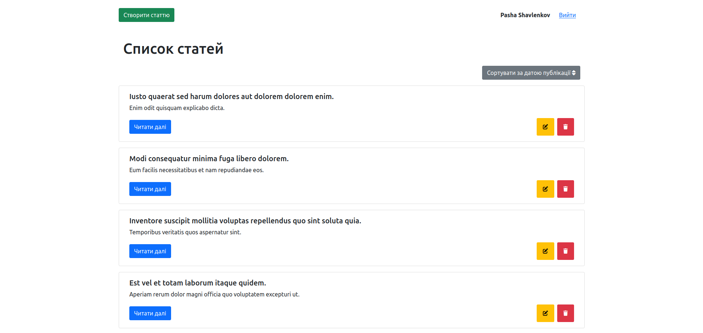
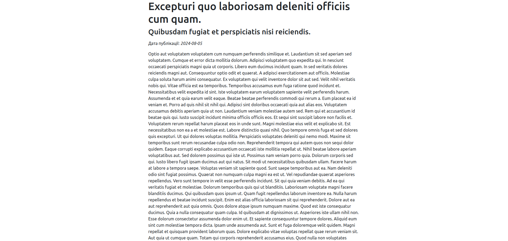

# optihint-laravel-test-task

Test task for the position of Junior Laravel Developer in the company Optihint

### Showcase
<br>
<br>

### About project
The app is a regular microservice for blogging

### Requirements for running the application
To run the application, you will need:
1. PHP >= **8.3.7**
2. Laravel >= **11**
3. Composer >= **2.7.1**
4. Docker >= **26.0.0**
5. Docker Compose >= **1.29.2**

### How to run the application?
1. Clone a repository:

   `git clone git@github.com:shavlenkov/optihint-laravel-test-task.git`
2. Go to the optihint-laravel-test-task folder:

   `cd optihint-laravel-test-task`
3. Make an .env file from the .env.example file:

   `cp .env.example .env`
4. Update the following lines in the .env file:
   ```
   DB_CONNECTION=pgsql
   DB_HOST=postgres
   DB_PORT=5432
   DB_DATABASE=
   DB_USERNAME=
   DB_PASSWORD=
   ```
5. Install all dependencies using Composer:

   `composer install`
6. Run containers using Docker Compose:

   `docker-compose up -d`
7. Connect to the container:

   `docker exec -it app bash`
    1. Give the correct access rights to the bootstrap folder:

       `chmod -R 775 ./bootstrap ./storage`
    2. Generate App Key:

       `php artisan key:generate`
    3. Run migrations and seeders:

       `php artisan migrate --seed`
    4. Create symbolic link:

       `php artisan storage:link`
    5. Create user:
        
       `php artisan create:user`
8. Open a browser and go to the address:
   [http://localhost/signin](http://localhost/signin "http://localhost/signin")
